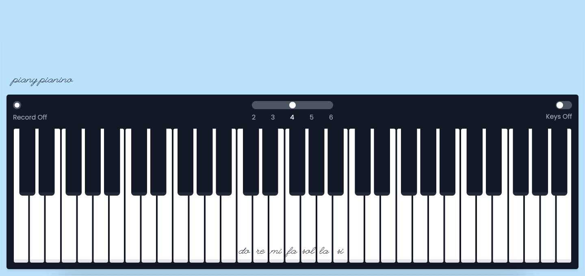

# Piany Pianino 🎹

> 1.0.0

I made a responsive piano application (#ForTheLulz) to experiment some new **Angular**'s features (May 2023), especially the [Signals](https://angular.io/guide/signals/) API.

## Preview



## Process

Repository:

```
git clone https://github.com/DmnChzl/PianyPianino.git
```

Install:

```
npm install
```

Dev:

```
npm start
```

Build:

```
npm build
```

Enjoy! 👌

## License

```
"THE BEER-WARE LICENSE" (Revision 42):
<phk@FreeBSD.ORG> wrote this file. As long as you retain this notice you
can do whatever you want with this stuff. If we meet some day, and you think
this stuff is worth it, you can buy me a beer in return. Damien Chazoule
```